<p align="center">
  
</p>

<h1 align="center">Narancs Signage</h1>

<p align="center"><b>English</b> · <a href="README.hu.md">Magyar</a></p>

<p align="center"><a href="https://mzzg-bazsi.github.io/narancs-signage-website/"><b>🌐 Website &amp; interactive demo</b></a></p>

A complete, self-hosted digital signage system: a central admin panel (with a soft orange theme), a browser-based player that also runs on ARM, and one-command installers for Ubuntu Server.

<p align="center">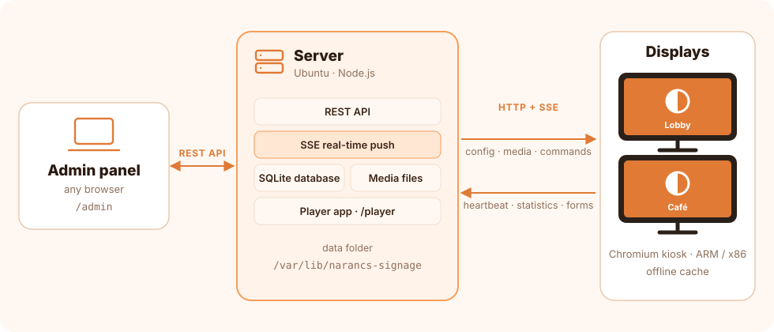</p>

<p align="center">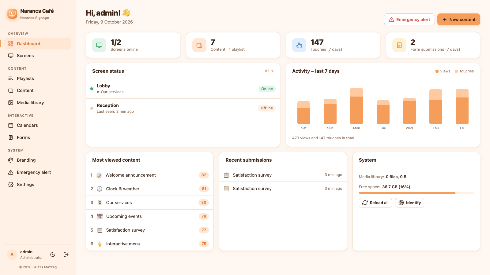</p>

## Screenshots

**Admin panel**

<table>
  <tr>
    <td width="50%">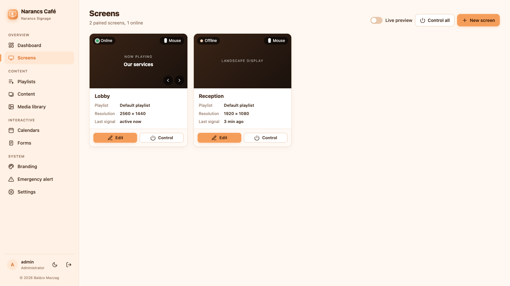<br><sub>Screens</sub></td>
    <td width="50%">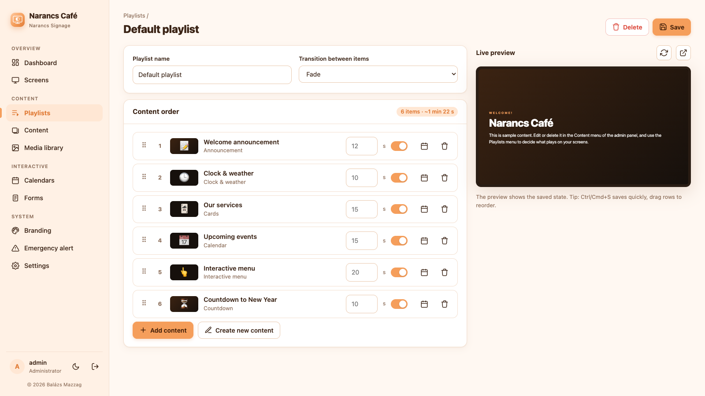<br><sub>Playlist editor with live preview</sub></td>
  </tr>
  <tr>
    <td width="50%">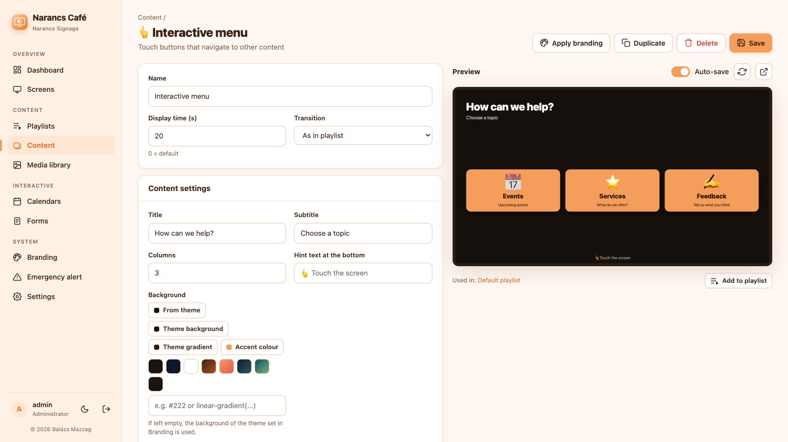<br><sub>Content editor (interactive menu)</sub></td>
    <td width="50%">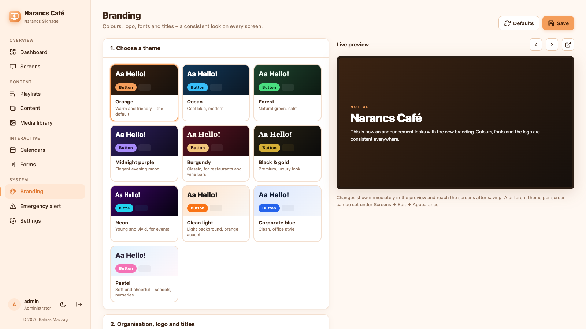<br><sub>Branding: 10 themes, live preview</sub></td>
  </tr>
  <tr>
    <td width="50%">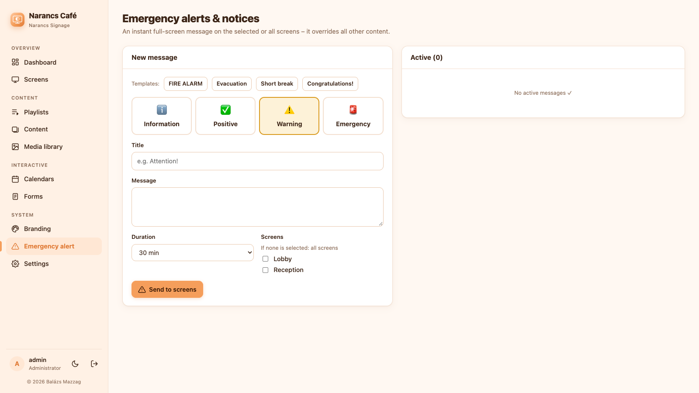<br><sub>Emergency alerts</sub></td>
    <td width="50%">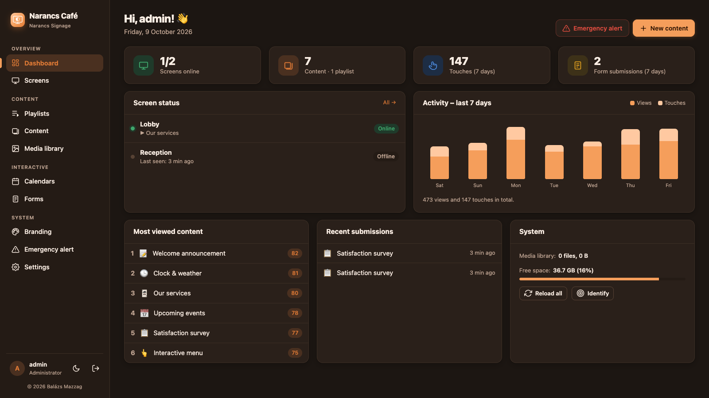<br><sub>Dark mode</sub></td>
  </tr>
</table>

**Player (on the display)**

<table>
  <tr>
    <td width="50%">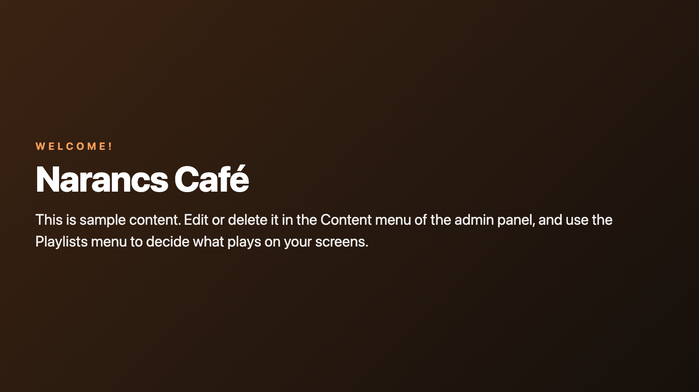<br><sub>Announcement</sub></td>
    <td width="50%">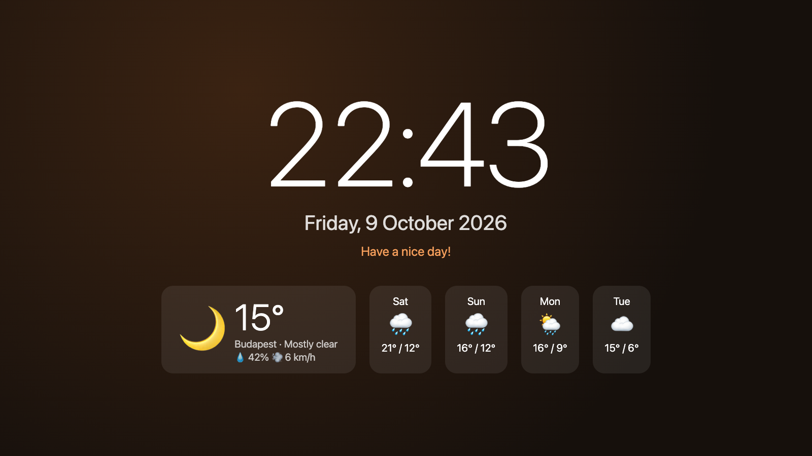<br><sub>Clock & weather</sub></td>
  </tr>
  <tr>
    <td width="50%">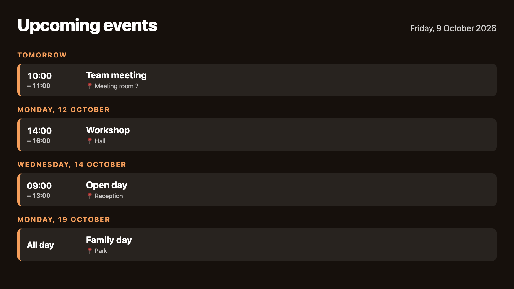<br><sub>Calendar</sub></td>
    <td width="50%">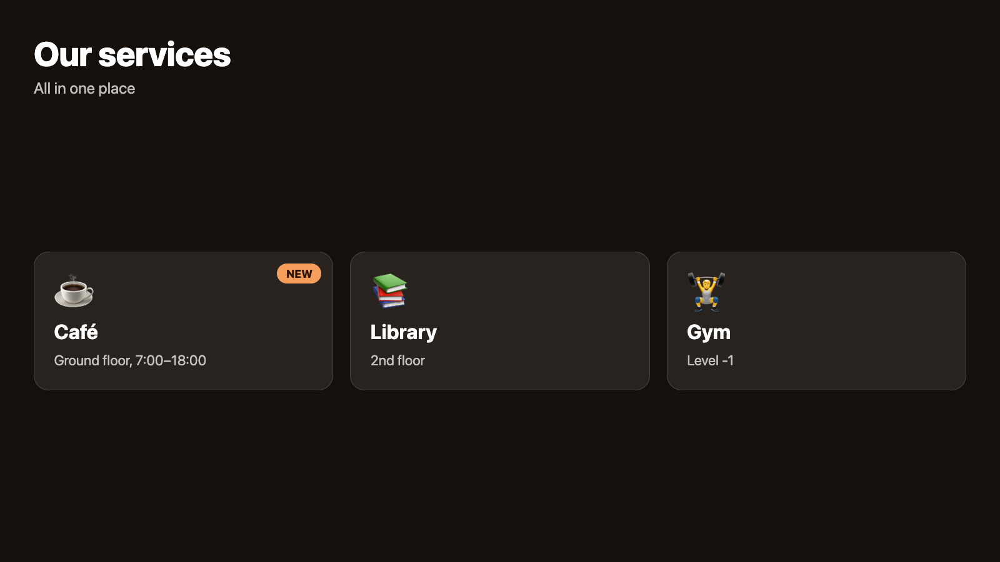<br><sub>Cards</sub></td>
  </tr>
  <tr>
    <td width="50%">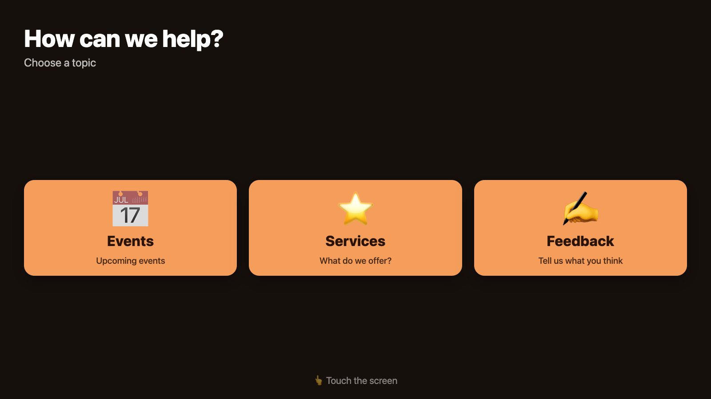<br><sub>Interactive menu</sub></td>
    <td width="50%">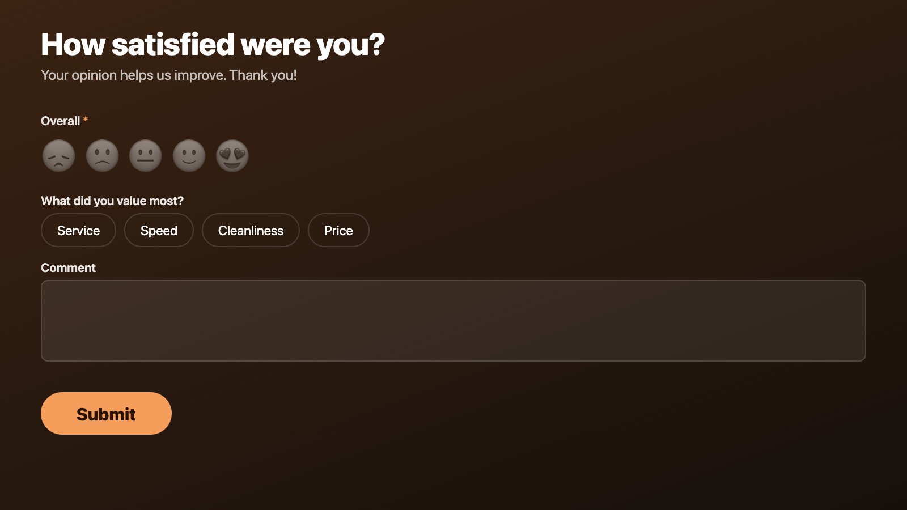<br><sub>Touch-screen form</sub></td>
  </tr>
</table>

## Features

**Content types (15)**
| Type | Description |
|---|---|
| 🖼️ Image slideshow | Several images/videos rotating automatically – fade, slide, Ken Burns effect, captions, page dots, blurred background |
| 🎬 Video | Play to the end or for a set time, with sound or muted |
| 📝 Announcement | Title, text, background image/video, gradients, logo |
| 🃏 Cards | Tile layout with icons, images and badges – a tap can open other content |
| 👆 Interactive menu | Touch buttons that navigate to other content (Back/Home buttons, automatic return after inactivity) |
| 📋 Form | Surveys, registrations – virtual keyboard (English/Hungarian layout), smiley/star ratings, CSV export |
| 📅 Calendar | List, week and month view; your own events + Google/Outlook iCal import (refreshed every 15 minutes) |
| 🕒 Clock & weather | Digital/analogue clock, current weather and 5-day forecast (Open-Meteo, no API key needed) |
| 📰 News feed | Any RSS/Atom source, with images |
| ⏳ Countdown | Time left until an event |
| 🔳 QR code | Built-in QR generator (links, Wi-Fi login, etc.) |
| 🌐 Website | Embed an external page/dashboard, zoom, timed reload |
| 📄 PDF | Show a document |
| 🧩 Custom HTML | Your own HTML/CSS/JS code in an isolated frame |
| 🔲 Split screen | Several content items at once in zones (sidebar, bottom bar, L-shape, columns, 2 × 2 grid) |

**Playback and scheduling**
- Playlists with drag & drop ordering, per-item duration, on/off switch and validity dates
- Per-screen scheduling: different playlists by day, time window and date range (e.g. breakfast menu 7–10 am)
- Scheduled screen off (operating hours) – on an installed player it also turns the monitor off (DPMS)
- Transitions: fade, slide in, zoom, float up

**Screen management**
- Pairing with a 6-digit code, online/offline status, currently playing content, resolution
- Remote commands: identify, previous/next, reload, clear cache, restart player or device, **live screenshot of the real display**
- Software rotation (landscape/portrait/upside down), corner clock, news ticker, progress bar, custom accent colour
- Live preview of every content item, playlist and screen in the admin panel

**More**
- 🌍 Selectable language (English / Hungarian, English by default): admin panel, displays, server messages
- 🚀 A default playlist with sample content on first install – a newly paired screen shows something right away
- 🎨 Branding: 10 built-in themes (Orange, Ocean, Forest, Midnight purple, Burgundy, Black & gold, Neon, Clean light, Corporate blue, Pastel), custom colours, fonts, corner rounding, logo watermark, header bar with title/subtitle/clock, a different theme per screen – with live preview
- 🚨 Emergency alerts / notices: an instant full-screen message on all or selected screens (templates: fire alarm, evacuation…), with expiry
- 📊 Dashboard: online screens, view and touch statistics, most viewed content, form submissions
- 📈 Reports (proof of play): what played where and how often, by content and screen, with CSV export
- 📴 Offline operation: the player caches its configuration and media files and keeps running if the server goes down
- 👥 Multiple users with roles (administrator, editor, viewer), API keys for integrations, session management, brute-force and CSRF protection
- 🐳 Docker image (amd64 + arm64) besides the Ubuntu installer
- 📦 Templates: 10 ready-made content packs (restaurant, office, shop, clinic, school, hotel, gym, conference, bar, salon) with live preview; export any content or playlist as a `.narancs.json` file and import it into another system; browse and install community templates from the [template gallery](https://github.com/mzzg-bazsi/narancs-signage-templates) – or submit your own
- 💾 Automatic daily backup + downloadable database backup
- 🌗 Light/dark mode in the admin panel, works on mobile too

## Installation

### 1. Server (Ubuntu / Debian, amd64 or arm64 – or macOS)

```bash
curl -fsSL https://github.com/mzzg-bazsi/narancs-signage/releases/latest/download/install.sh | sudo bash
```

The one-line installer downloads the latest [release](https://github.com/mzzg-bazsi/narancs-signage/releases) and runs `install/install-server.sh` (from a cloned folder you can run that directly). On **macOS** run the same command without `sudo`: it installs Node.js with Homebrew if needed and starts the server at login (LaunchAgent).

The installer sets up Node.js 24 (if missing), creates the `narancs-signage` systemd service, configures a daily backup and prints the address of the admin panel. Different port: `... | sudo bash -s -- --port 80`.

Open the printed address (`http://SERVER-IP:8080/admin/`). On first visit you choose the language and create the admin account; a default playlist with sample content is created as well.

#### Or with Docker (any Linux, NAS, Synology, Unraid – amd64 and arm64)

```bash
docker run -d --name narancs-signage -p 8080:8080 -v narancs-signage:/data -e TZ=Europe/Budapest --restart unless-stopped ghcr.io/mzzg-bazsi/narancs-signage:latest
```

Or `docker compose up -d` with the [docker-compose.yml](docker-compose.yml) in the repository. The data lives in the `/data` volume.

**Locked out?** On the server: `sudo signage-reset-password <username>` (prints a new password; `--admin` also makes the user an administrator).

### 2. Display / player (Ubuntu Server or Raspberry Pi OS Lite – arm64, armhf, amd64)

On the device connected to the display, run a single command:

```bash
curl -fsSL http://SERVER-IP:8080/install-player.sh | sudo bash
```

(The command is also shown, ready to copy, in the admin panel under **Screens → New screen**.)

The installer sets up a minimal X11 environment (no window manager) and Chromium (no desktop environment), configures automatic login and starts the player in kiosk mode. After a restart the screen shows a **6-digit code** – enter it in the admin panel.

Options (append after `-s --`, e.g. `| sudo bash -s -- --nightly-reboot`):
- `--nightly-reboot` – restart every night at 04:30
- `--rotate 90|180|270` – hardware screen rotation (software rotation can also be set in the admin panel)

> **Everything on one device:** install the server first, then the player on the same machine with the address `http://localhost:8080`.

> **Without installing:** opening `http://SERVER-IP:8080/player/` in any browser also works (e.g. smart TV, tablet, mini PC).

## Local development

Requires Node.js ≥ 22.13 – no other dependencies (uses the built-in `node:sqlite`).

```bash
cd server
npm run dev
```

Admin: <http://localhost:8080/admin/> · Player: <http://localhost:8080/player/>

## Structure

```
server/
  src/server.js        HTTP server, REST API, SSE push, player configuration
  src/db.js            SQLite schema and data layer (node:sqlite)
  src/auth.js          users, sessions (scrypt)
  src/feeds.js         iCal, RSS, weather (Open-Meteo)
  src/http.js          mini router, static files with Range support (video)
  src/i18n.js          server-side translations
  src/seed.js          sample content (default playlist)
  public/admin/        admin SPA (vanilla JS, no build step)
  public/player/       player (vanilla JS, service worker, QR generator, virtual keyboard)
  public/shared/       shared: translations (i18n.js), branding themes (themes.js), logo
install/
  install.sh           one-line installer from GitHub (Ubuntu/Debian → install-server.sh, macOS → LaunchAgent)
  install-server.sh    server installer (systemd, backup, firewall)
  install-player.sh    kiosk installer (X11, Chromium, autologin, monitor schedule)
```

Translations: every UI string is wrapped in `tr('…')` with the original Hungarian text as the key; the English texts live in `server/public/shared/i18n.js` (and `server/src/i18n.js` for server messages). New languages can be added there.

## Operations

| Task | Command |
|---|---|
| Status | `systemctl status narancs-signage` |
| Logs | `journalctl -u narancs-signage -f` |
| Manual backup | `sudo signage-backup` (→ `/var/backups/narancs-signage/`) |
| Update | `curl -fsSL https://github.com/mzzg-bazsi/narancs-signage/releases/latest/download/install.sh \| sudo bash` (data is kept) |
| Data location | `/var/lib/narancs-signage` (database + media) |
| Player settings | `/etc/narancs-signage/player.conf` on the display device |

**HTTPS:** put a reverse proxy in front of it (e.g. Caddy: `signage.example.com { reverse_proxy localhost:8080 }`). Because of SSE, disable response buffering in the proxy (nginx: `proxy_buffering off;`).

## Notes

- Some websites (Google, Facebook, etc.) block embedding; they will not show in the “Website” content type.
- Video sound works on an installed player (the kiosk allows autoplay with sound); in a regular browser the browser may mute it.

## Versioning

Versions follow [semantic versioning](https://semver.org/) (`MAJOR.MINOR.PATCH`); changes are listed in [CHANGELOG.md](CHANGELOG.md) (in Hungarian). To install a specific version: `git checkout v1.9.2`.

**Releasing a new version:**
1. Describe the changes at the top of `CHANGELOG.md` in a new `## [X.Y.Z] – date` section and commit.
2. Run `./scripts/release.sh patch` (bug fix), `minor` (new feature) or `major` (breaking change) – it bumps the version, commits, creates a tag and pushes.

## License

© 2026 Balázs Mazzag – [Narancs Signage License](LICENSE)

Programmed entirely by [Claude](https://claude.com/claude-code) (Anthropic): every line of code, the installers, the website and the documentation were written by Claude Code, based on the ideas and direction of Balázs Mazzag.

Anyone may use, modify and share it freely and free of charge – for business purposes and in large companies too. **Only the author may sell the software:** nobody else may sell it, rent it out or offer it as a paid service (charging for installation, operation or content creation is allowed). **Attribution is required:** keep the license file and the copyright notice, do not remove the “© 2026 Balázs Mazzag” notice shown in the admin panel, and when passing it on, state that it is based on “Narancs Signage by Balázs Mazzag”. No notice is shown on the displays.
